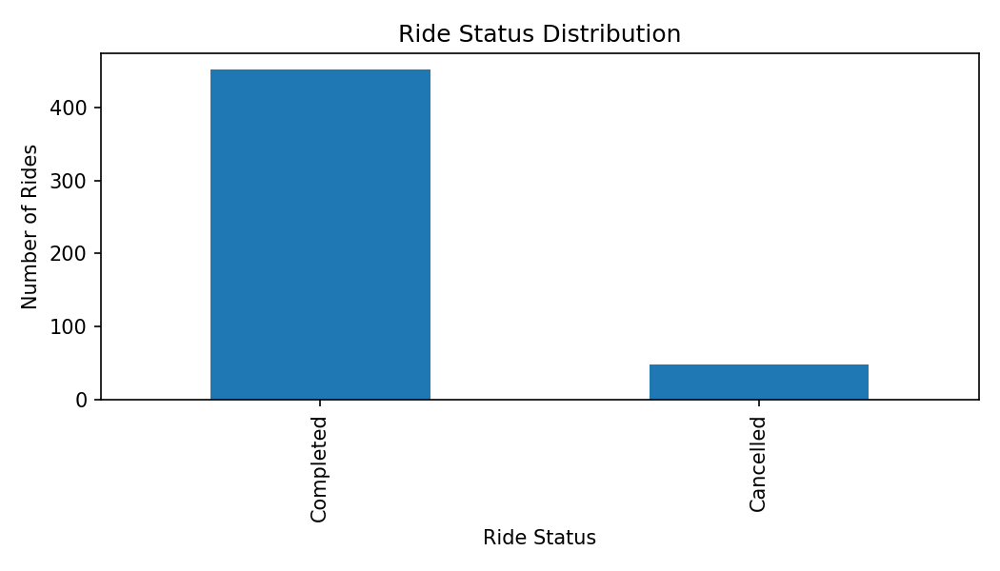
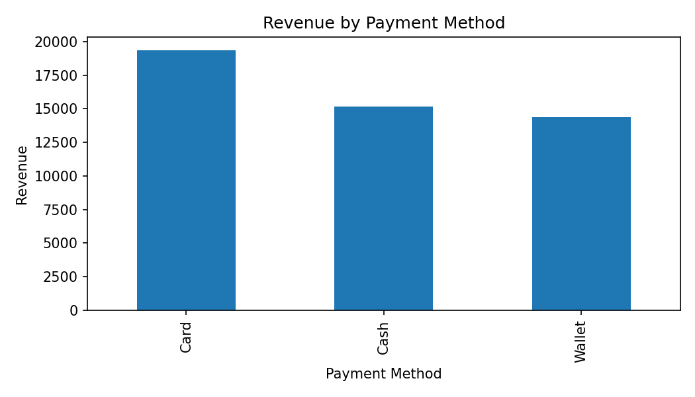
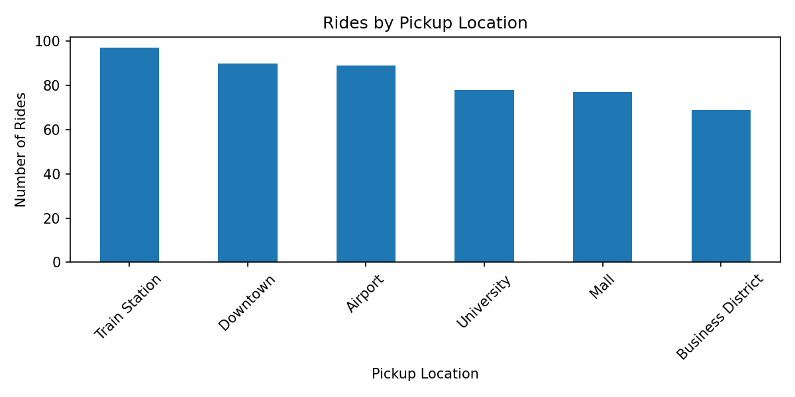
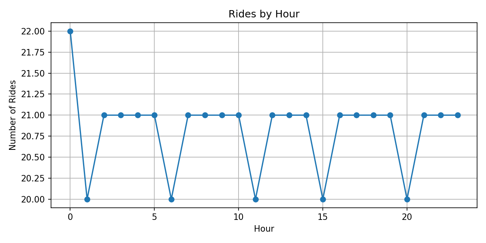

# Ride-Sharing Data Engineering Pipeline

## Project Overview

A beginner-friendly data engineering project that builds an end-to-end pipeline for ride-sharing data.

The project demonstrates how synthetic ride data can be extracted, validated, transformed, loaded into a database, and analyzed using SQL and Python.

## Data Pipeline

**Raw CSV → Extract → Data Quality Checks → Transform → Processed CSV → SQLite Database → SQL Analytics → Dashboard**

## Technologies Used

* Python
* Pandas
* NumPy
* SQLite
* SQL
* Matplotlib
* Google Colab
* GitHub

## Dataset

The project uses a **synthetic dataset of 500 ride records** designed to simulate ride-sharing operations.

The dataset contains ride-level information including:

* Ride ID
* Driver ID
* Pickup Location
* Dropoff Location
* Ride Date
* Distance
* Duration
* Fare
* Payment Method
* Ride Status
* Rating

## ETL Process

### Extract

Raw ride data is loaded from a CSV file using Pandas.

### Transform

The pipeline performs:

* Date conversion
* Data quality validation
* Ride month extraction
* Ride day extraction
* Ride hour extraction
* Fare-per-kilometer calculation

### Load

The transformed dataset is:

* Saved as a processed CSV file
* Loaded into a SQLite database

## Data Quality Checks

The pipeline validates:

* Positive ride distance
* Positive ride duration
* Non-negative fares
* Duplicate ride IDs
* Missing values
* Valid ride statuses

Cancelled rides may have missing ratings because no customer rating is expected for a cancelled ride.

## Database Model

The project contains three main tables:

* **rides** — ride-level transactional data
* **drivers** — unique driver IDs
* **locations** — unique pickup and dropoff locations

## SQL Analytics

The project includes SQL queries for:

* Total completed revenue
* Average completed ride fare
* Ride status distribution
* Cancellation rate
* Revenue by payment method
* Rides by pickup location
* Rides by hour

## Dashboard

Python and Matplotlib are used to visualize:

* Ride status distribution
* Revenue by payment method
* Rides by pickup location
* Rides by hour

The dashboard reads ride data from the SQLite database and provides a simple visual overview of ride activity and revenue.

### Dashboard Visualizations

#### Ride Status Distribution



#### Revenue by Payment Method



#### Rides by Pickup Location



#### Rides by Hour



## Project Structure

```text
ride-sharing-data-pipeline/
│
├── data/
│   ├── raw/
│   │   └── raw_rides.csv
│   │
│   └── processed/
│       └── processed_rides.csv
│
├── src/
│   └── etl_pipeline.py
│
├── sql/
│   └── sql_queries.sql
│
├── dashboard/
│   └── dashboard.py
│
├── ride_sharing.db
├── ride_status.png
├── revenue_payment.png
├── pickup_location.png
├── rides_by_hour.png
├── requirements.txt
└── README.md
```

## Key Results

The pipeline was tested on a synthetic dataset of **500 ride records**.

* **Total rides:** 500
* **Completed rides:** 452
* **Cancelled rides:** 48
* **Cancellation rate:** 9.6%
* **Average completed fare:** 108.19
* **Total revenue:** 48,900.17

These results were generated after applying data quality checks, transformations, loading the processed data into SQLite, and running SQL analytics.

## What This Project Demonstrates

This project demonstrates practical understanding of:

* ETL pipeline development
* Data cleaning and validation
* Data transformation
* SQL analytics
* Database loading
* Basic data modeling
* Data visualization
* Python data engineering workflows

## Future Improvements

Possible future improvements include:

* PostgreSQL integration
* Apache Airflow orchestration
* Larger datasets
* Automated data ingestion from APIs
* Docker containerization
* Power BI or Streamlit dashboard
* Automated data quality monitoring
